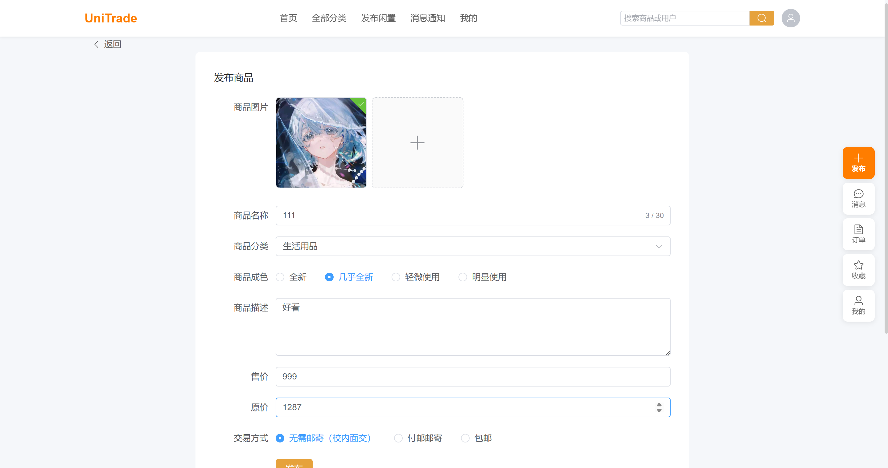
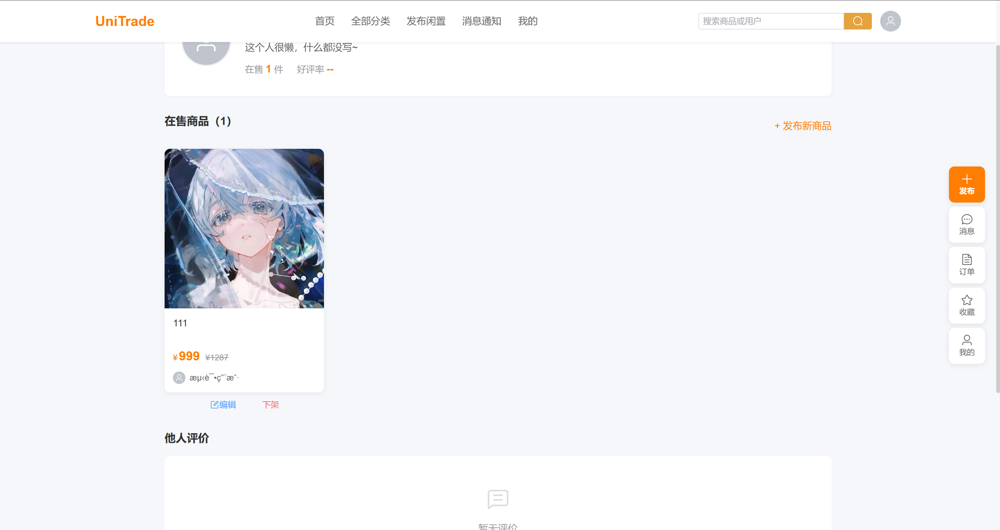
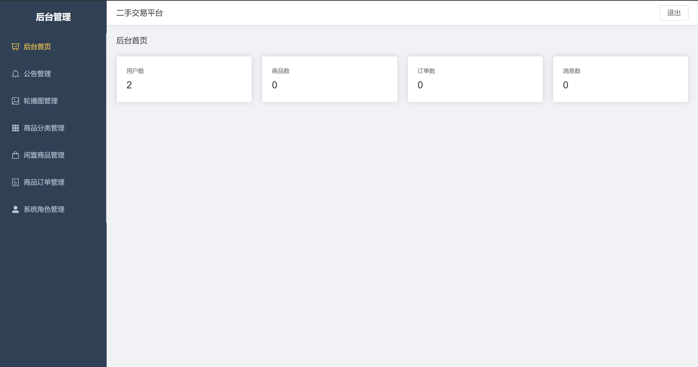
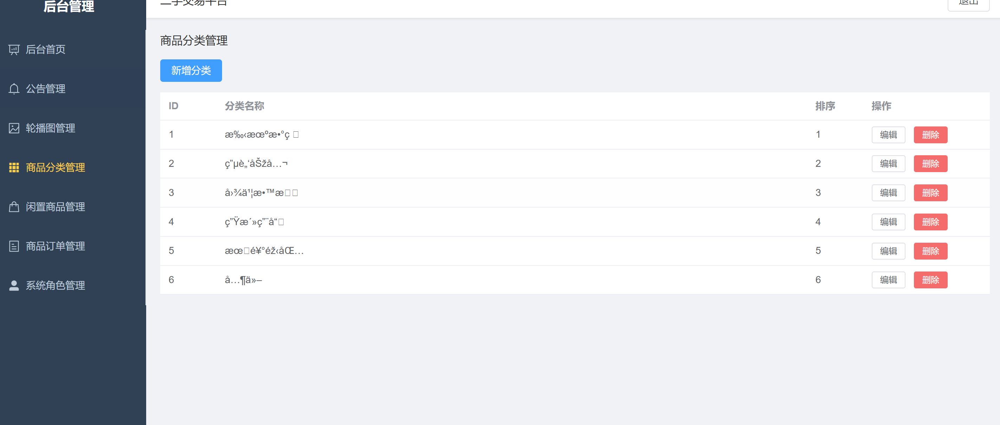

# UniTrade - 校园二手交易平台

一个校园二手闲置交易平台，支持发布商品、搜索、买卖家实时聊天、订单管理。

## 技术栈

- 后端：SpringBoot 3.4 + MyBatis-Plus + JWT + WebSocket + Redis
- 前端：Vue3 + Element Plus + TailwindCSS
- 数据库：MySQL 8 + Redis

## 做了啥

商品功能比较常规，发布、搜索、分类筛选、收藏。搜索支持标题和卖家昵称模糊匹配，商品详情加了 Spring Cache + Redis 缓存，编辑或者下架的时候自动清缓存。

聊天这块用 WebSocket 做的，前端连上长连接，消息直接推，不用一直轮询。在线用户用 ConcurrentHashMap 存着，消息先写到数据库再推送，这样就算人不在线，下次登录也能看到聊天记录。

订单流程参考了闲鱼的：待付款 -> 已付款 -> 已发货 -> 已完成，支持取消和退款。下单的时候会检查这个商品有没有正在进行的订单，防止同个商品被多个人同时买走。

接口限流用了 Guava 的 RateLimiter，读接口 20 次/秒、写接口 3 次/秒，按 IP 区分。认证用的 JWT，前端请求头带 token，后端拦截器校验，用户 ID 通过 ThreadLocal 传递，不用每次都从 token 解析。

后台管理分了 7 个模块：数据概览、公告、轮播图、商品分类、商品管理、订单管理、角色管理。

## 怎么跑

确保 MySQL 和 Redis 先跑起来，然后导入项目根目录下的 `init.sql` 建库建表。

```bash
git clone https://github.com/Evan7J/UniTrade.git
cd UniTrade/Uni-trade
# application.yml 里改一下数据库密码
mvn spring-boot:run
```

前端：

```bash
cd UniTrade/frontend
npm install
npm run dev
```

管理员账号：`admin` / `Admin@123456`
测试用户：`13800138000` / `123456`

## 页面截图

发布商品：



个人主页：



后台 Dashboard：



分类管理：

