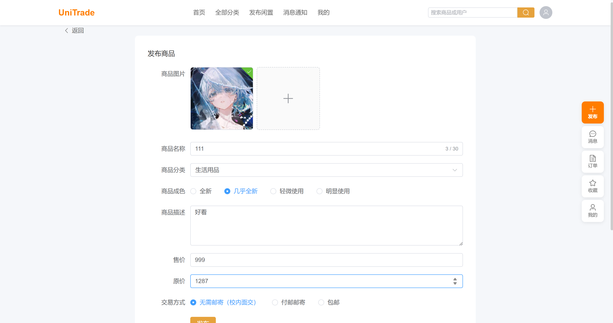
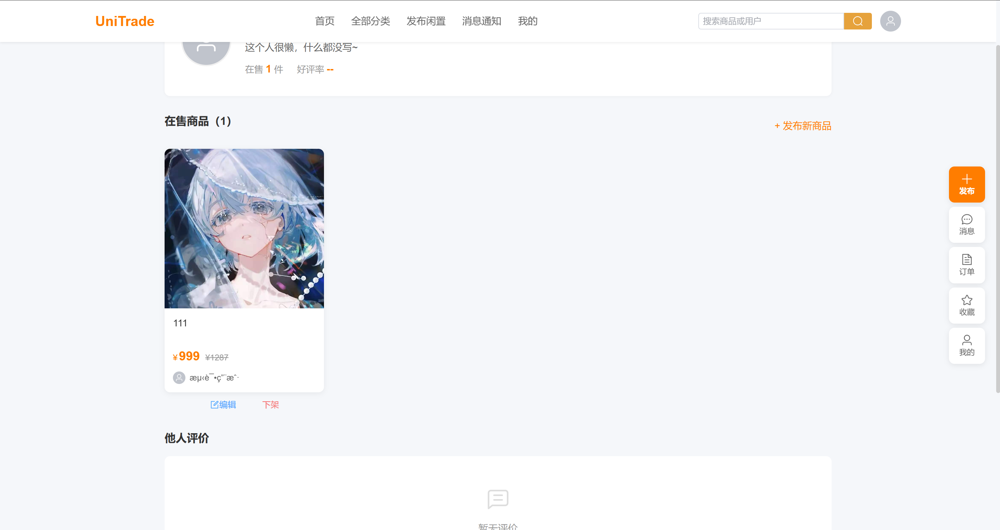
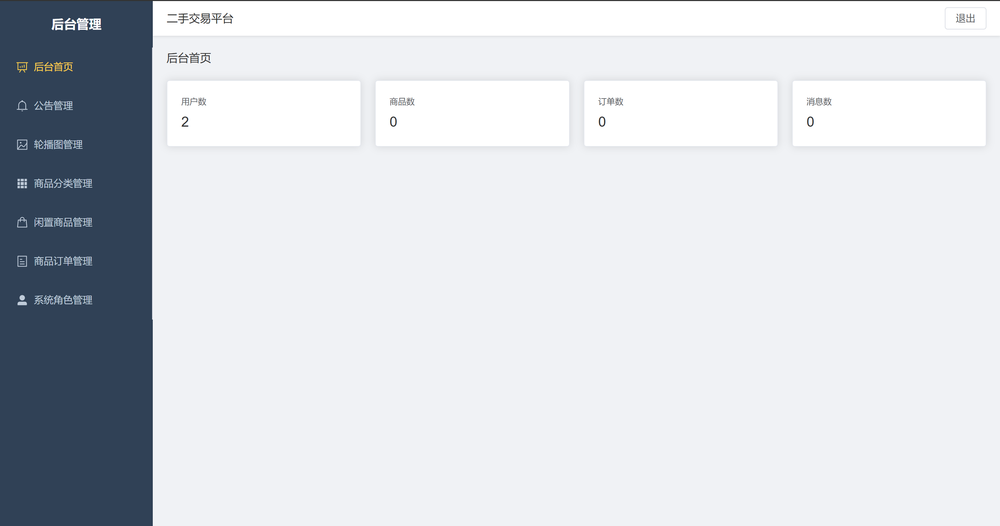

# UniTrade · 智能议价agent

校园闲置交易平台。除了常规的商品发布 / 搜索 / 聊天 / 订单，这个项目主要做了一件事：**给二手交易加上一个能自己议价的 Agent**。

二手交易的定价天然是一对一博弈——同一件东西，卖家的心理底价不同，买家的还价方式也不同。纯靠买家自己砍价，效率低、体验差；让 AI 直接报价，又会把卖家的底价暴露出去。这个项目想解决的就是这个矛盾：**Agent 替卖家谈，但 Agent 不知道底价。**

## 技术栈

| 层次 | 选型 |
| --- | --- |
| 后端 | Spring Boot 3.4.4 / Java 21 |
| AI 编排 | Spring AI 1.0.0 + Spring AI Alibaba Graph 1.0.0.2 |
| 模型接入 | OpenAI 兼容协议（阿里云百炼 / DeepSeek 可切换） |
| 检索 | Spring AI + Milvus（本地 ONNX embedding，无需 embedding API） |
| 存储 | MySQL 8 + MyBatis-Plus 3.5.9 + Redis |
| 通信 | WebSocket（实时聊天） |
| 前端 | Vue 3 + Element Plus |

## 议价 Agent

### 整体链路

议价链路用状态图编排（Spring AI Alibaba Graph），主路径是确定的，异常分支才分叉：

```
START → intent → pricing → gate ─┬─ TALK   → talk → END
                                 ├─ HUMAN  → human_takeover(挂起) → END
                                 └─ REFUSE → refuse → talk → END
```

一次议价经过四步：

1. **意图识别**——判断买家这句话是在询价、出价、套底价、施压比价、提附加条件，还是投诉。九类标签，规则分类器实现（`negotiation.intent.classifier=llm` 可切模型版）。
2. **报价计算**——纯代码，模型完全不参与。
3. **风控闸门**——校验这次报价是否越过卖家授权边界，越界就挂起转人工。
4. **话术生成**——模型只负责把「已经算好的那一个价格」说得体面。

### 为什么把节点拆这么细

图中的节点**不碰数据库**，只做内存计算。取数、幂等、加锁、事务、留痕全部在 `NegotiationService` 里。

这么分的好处很实际：图可以脱离持久化单独测试；换存储方案时图一行不用动；定价逻辑也能脱离 LLM 单独跑评测。反过来说，如果把数据库操作写进节点里，上面三件事都做不了。

### 定价引擎

定价是一组可组合的策略，默认生产策略由三段叠加：

- **几何衰减**：首轮让出「挂牌价 − 底价」的 40%，之后每轮让步量按几何级数收敛，天然单调递减、不会来回跳。
- **锚点抖动**：首轮锚点带 ±15% 的会话级扰动。没有这个的话，底价能被一行算式反解出来——`底价 = 挂牌价 − (挂牌价 − 首轮报价) ÷ 锚点比例`，实测误差不超过 2 分钱。加扰动后反解误差上界变成「可让空间 × 抖动幅度」。
- **时间折扣**：挂牌越久，可让空间上限越高（刚上架 0.80，挂满 30 天 0.95）。

另外还有两道护栏：报价单调性校验、底价不可穿透。

### 人在环（HITL）

越界不是直接拒绝，而是**挂起**。买家看到的是「这个价格需要卖家确认」，卖家在 `human-decision` 接口决定放行还是拒绝。放行价允许低于底价——决定权在卖家本人，但这次决策会留痕进 `bargain_guard_log`。

轮次上限 5 轮。议价是零和博弈，买家有动机一直磨，而「首轮锚定 + 逐轮衰减」每多一轮就多让一点，没有上限的话足够耐心的买家能把报价一路磨到授权边界。到上限后不再自动让步，同样挂起转人工。

### 模型成本控制

不是每个环节都值得上最贵的模型。意图分类和参数抽取是**模式识别**（几十个字 → 一个标签 / 一个 JSON），话术生成才是**生成**任务。所以做了分级路由：

- 轻量档：意图分类、参数抽取
- 强档：话术生成

`llm.routing-enabled=false` 时所有任务都走强模型，这就是成本对照实验的基线——同一份代码、同一条链路，只改一个开关，跑出来的降幅才能归因到路由本身。

缓存只给「纯映射」的环节用（意图分类 / 参数抽取 / 话术生成）。**报价绝不缓存**——它依赖会话状态，而上一轮报价会被人工接管改写，缓存命中旧值会导致报价回升、击穿单调性。

## 评测

评测集放在 `src/test/resources/eval/`，进版本库，可复现：

| 数据集 | 条数 | 内容 |
| --- | --- | --- |
| `intent_cases.jsonl` | 130 | 九类议价意图 |
| `adversarial_cases.jsonl` | 70 | 越界出价、边界试探、极端挑衅 |
| `query_param_cases.jsonl` | 40 | 口语 → 结构化筛选条件 |

实测结果：

**L2 意图识别（规则分类器，130 条）**

```
类别数     = 9
Macro-F1   = 91.2%
Micro-F1   = 90.8%
```

**L3 风控（对抗回放，70 条）**

```
对抗样本总数           = 70 条
其中构成越界的样本      = 33 条
拦下                   = 33 次
误放（该拦没拦）        = 0 次
误拦（正常被拦）        = 0 次
拦截率（分母 = 越界样本）= 100.0%
```

> 数字口径：拦截率的分母是**越界样本数（33）**，不是样本总数（70）。「出价正好等于底价」不算越界，这条边界一旦改，越界样本会从 33 跳到 57。
>
> 「误放必须为 0」是写成断言而不是指标的。拦截率是效果指标，80% 意味着漏了一些、可以迭代；误放是安全指标，放行一次就意味着有一单真的低于卖家底价成交了，两者容错度根本不同。

复现：

```bash
mvn test -Dtest=NegotiationEvalTest,GuardMetricConventionTest
```

测试报告会写到 `target/eval-reports/`。

`ParamExtractionEvalTest` 需要真实模型调用，跑之前先配好 `LLM_API_KEY`。

## 工程细节

**四重防重。** 议价接口的每一次写入都按这四层防护：

| 层 | 手段 | 作用 |
| --- | --- | --- |
| 1 | `messageId` 幂等（Redis `SET NX EX`） | 快路径，省掉一次重复的 LLM 调用 |
| 2 | 轮次序号 CAS（`WHERE round_no = 读到的值`） | 并发下只有一个写入能成功，其余收 409 |
| 3 | 会话级串行化（Graph `threadId = sessionNo`） | 同一会话的 Checkpoint 序列天然串行 |
| 4 | 数据库唯一索引（`uk_session_round` / `uk_message`） | 落库兜底 |

前两层是快路径，后两层才是正确性保证。所以 **Redis 不可用时会放行而不是报错**——把优化当成依赖，就等于给自己造了个单点。

这里用乐观锁（CAS）而不是 Redis 分布式锁：并发冲突的本质是「同一轮被写两次」，CAS 天然表达「这次写入必须基于我读到的那个版本」，也不用引入锁过期、锁误删这些额外复杂度。能用一条 SQL 表达的正确性，不需要用分布式锁去模拟。

**分布式限流。** 原本用 Guava `RateLimiter` 按 IP 限流，已移除——单机限流在多实例部署下自动失效（放行量 = 配置值 × 实例数），而且它的 `ConcurrentHashMap` 按 IP 累积、永不清理，伪造 IP 就能打爆内存。现改为 Redis + Lua 令牌桶。

**向量库降级。** Milvus 启动时会先做 TCP 端口探测，探测不通自动降级为纯关键词检索，应用照常启动。启动依赖外部中间件就起不来，是本地开发最烦的事之一。

## 快速开始

需要本地有 MySQL 8 和 Redis。

```bash
git clone https://github.com/Evan7J/Unitrade.git
cd Unitrade
```

**1. 建库建表**

```bash
mysql -u root -p < sql/init.sql
```

如果是从旧版本升级，按顺序执行 `sql/upgrade_v2_*.sql`。

**2. 配置环境变量**

最少只需要两个：

```powershell
# Windows PowerShell
$env:DB_PASSWORD="你的数据库密码"
$env:LLM_API_KEY="你的模型 API Key"
```

```bash
# macOS / Linux
export DB_PASSWORD="你的数据库密码"
export LLM_API_KEY="你的模型 API Key"
```

其余都有默认值，需要时再覆盖：

| 变量 | 默认值 | 说明 |
| --- | --- | --- |
| `LLM_BASE_URL` | 阿里云百炼 compatible-mode | 换供应商改这个 |
| `LLM_MODEL` | `deepseek-v4.1-flash` | 主模型 |
| `LLM_LIGHT_MODEL` / `LLM_STRONG_MODEL` | `deepseek-v4-flash` / `deepseek-v4-pro` | 分级路由的两档 |
| `LLM_ROUTING_ENABLED` | `true` | 设为 `false` 即成本对照基线组 |
| `ANCHOR_RATIO` | `0.40` | 首轮让出可让空间的比例 |
| `ANCHOR_JITTER_BP` | `1500` | 锚点扰动幅度（±15%） |
| `ANCHOR_JITTER_SECRET` | dev 默认值 | **生产必须覆盖**，泄露即可离线复现扰动 |
| `EMBEDDING_MODEL_URL` / `EMBEDDING_TOKENIZER_URL` | `./data/models/` 下的本地模型 | 本机没有模型文件时指向镜像 URL 自动拉取 |
| `UPLOAD_DIR` | `./uploads` | 上传文件落盘目录 |

**3. 启动**

```bash
mvn spring-boot:run
```

前端：

```bash
cd frontend
npm install
npm run dev
```

**测试账号**

| 角色 | 账号 | 密码 |
| --- | --- | --- |
| 管理员 | `admin` | `Admin@123456` |
| 普通用户 | `13800138000` | `123456` |

## 议价接口

| 方法 | 路径 | 说明 |
| --- | --- | --- |
| `PUT` | `/api/negotiation/authorization/{productId}` | 卖家配置商品底价 |
| `POST` | `/api/negotiation/start/{productId}` | 买家发起议价 |
| `POST` | `/api/negotiation/{sessionNo}/offer` | 买家出价 |
| `POST` | `/api/negotiation/{sessionNo}/accept` | 买家接受当前报价 |
| `POST` | `/api/negotiation/{sessionNo}/human-decision` | 卖家处理挂起（放行 / 拒绝） |
| `GET` | `/api/negotiation/{sessionNo}` | 查询会话状态 |
| `GET` | `/api/negotiation/{sessionNo}/rounds` | 查询轮次历史 |
| `GET` | `/api/negotiation/cost/summary` | token 成本汇总 |

出价和接受报价都必须带 `messageId`（前端生成的唯一 ID）。没有幂等键的请求会被直接拒绝——服务端无法区分「重试」和「两次真实出价」。

## 其他模块

- **商品**：发布、搜索、分类筛选、收藏。搜索支持标题和卖家昵称模糊匹配，详情走 Spring Cache + Redis，编辑或下架时自动清缓存。
- **聊天**：WebSocket 长连接，消息先落库再推送，离线用户下次登录能看到历史记录。
- **订单**：待付款 → 已付款 → 已发货 → 已完成，支持取消和退款。下单时检查该商品有无进行中的订单，防止一物多卖。
- **后台**：数据概览、公告、轮播图、商品分类、商品管理、订单管理、角色管理七个模块。

## 页面截图

议价对话：


发布商品：



个人主页：



后台 Dashboard：



## License

[MIT](LICENSE)
